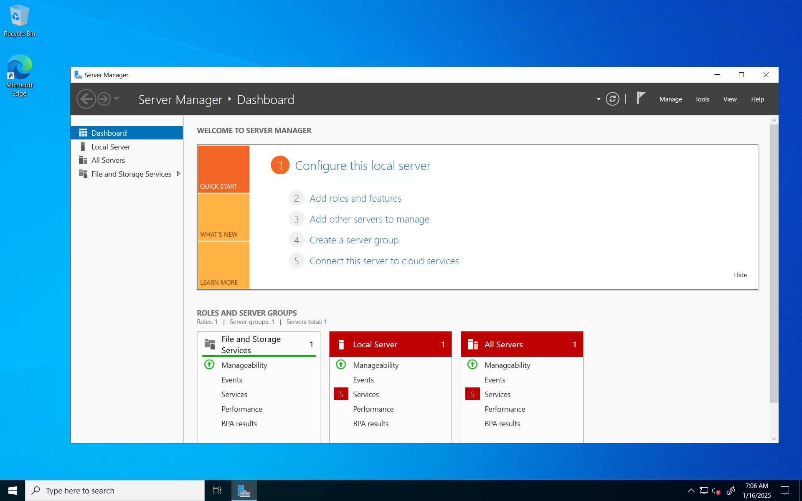
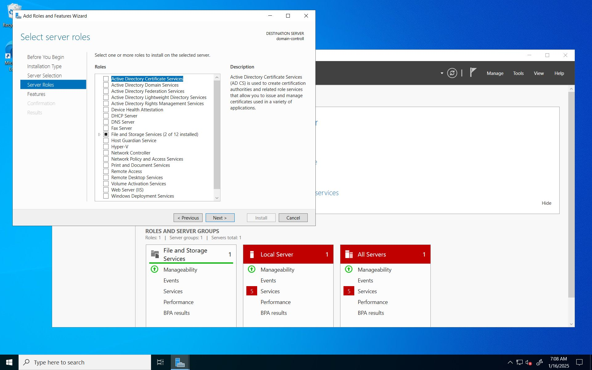
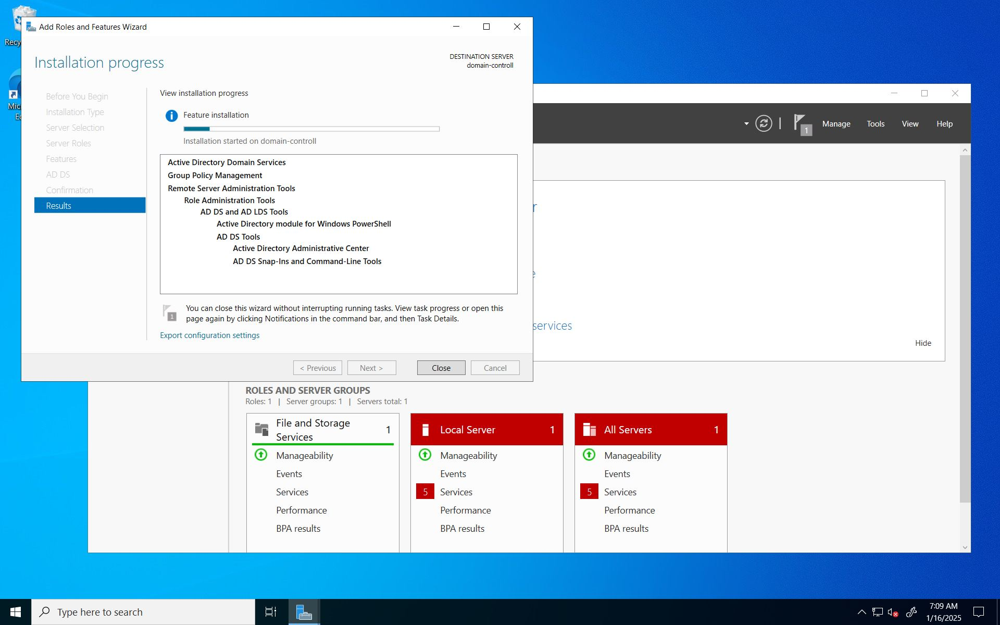
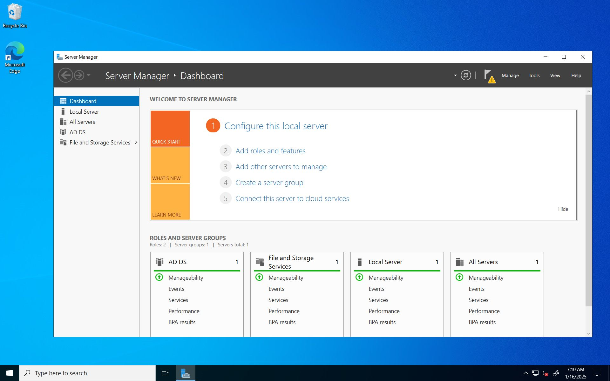
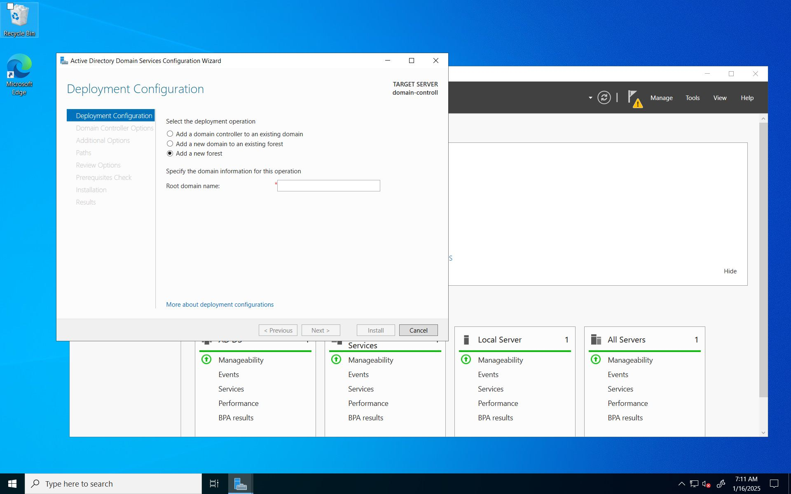
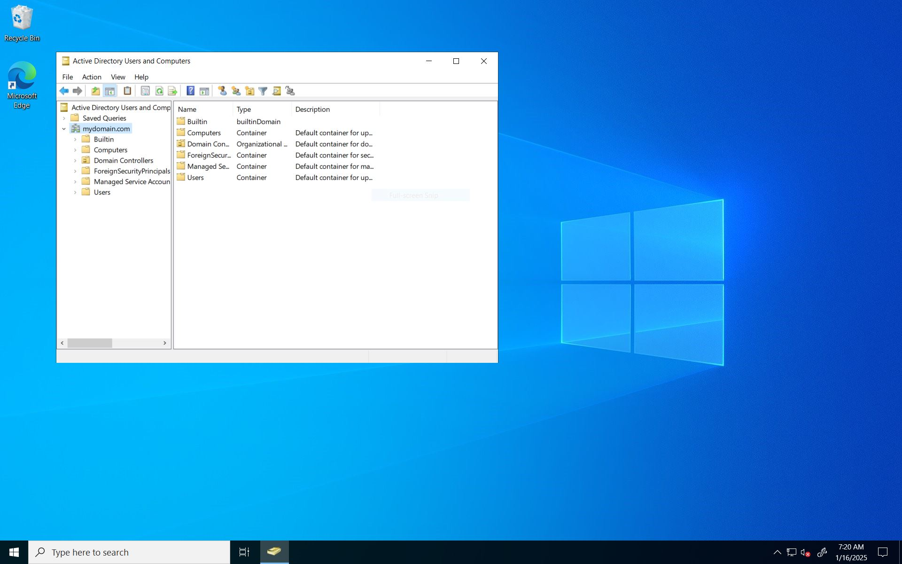
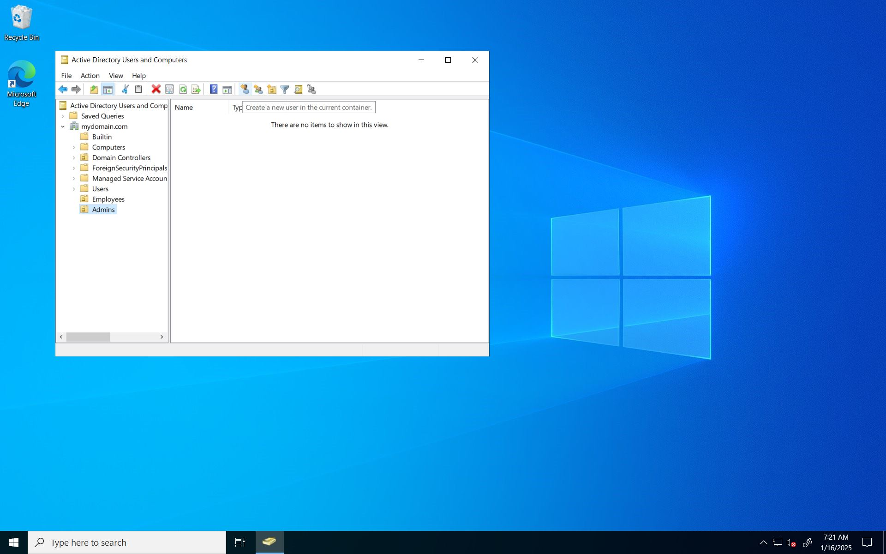

<h1>Deploying Active Directory in Azure</h1>

<h2>Description</h2>
This is part 2/3 of the Active Directory lab. In this portion, Active Directory will be installed on the domain controller, a domain admin will be made, and the client VM will be connected to the domain.   
 

<h2>Environments and Utilities Used</h2>

- <b>Microsoft Azure</b>
- <b>Virtual Machines</b>
- <b>Remote Desktop Connection</b>
- <b>Active Directory</b>

<h2>Operating Systems Used </h2>

- <b>Windows Server </b>
- <b>Windows 10</b>

<h2>Project Walk-through:</h2>

<h3>Log back into the domain controller VM and click "Add Roles and Features." We will now install Active Directory</h3>

<h3>Click "Next" until you get to the "Server Roles" tab. Once there, check <b></b>"Active Directory Domain Services"</h3>b></h3>

<h3>Now, click next until you are given the option to install. </h3>

<h3>A yellow flag should now appear at the top right of the screen. Click it and go to "Add a new forest"</h3>

You will be given the choice to choose any domain. For this lab, I chose "mydomain.com"

<h3>Make sure to unclick the option to create a new DNS delegation. Then, click next until you are given the option to install</h3>

<h2>Creating two "Organizational Units" to create to "folders." One for "Employees" and the other named "Admins."</h2>

<h3>Now open "Active Directory Users and Computers" and make the two OU's mentioned above <b>under the new domain</b>.</h3>

<h2>Adding the Windows 10 computer (which I named Client-1) to the domain</h2>

<h3>Log back in to the client VM and open the "About" page in the computer settings. Then open <b>"Rename PC (advanced)"</b> </h3>

Then click "Change"

<h3>Check "Domain" and enter the new domain name you made while in the domain controller</h3>

<h3>A new window will open (close the settings to see it). Now the VM will restart </h3>

